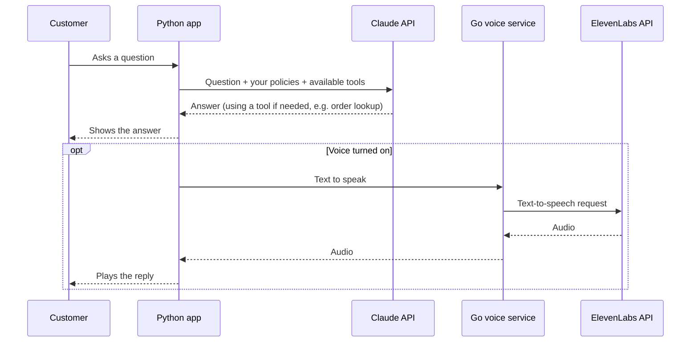

<p align="center">
  
</p>

<h1 align="center">Meduza</h1>
<p align="center">
  <em>An AI customer support chatbot for e-commerce stores.</em>
</p>
<p align="center">
  <a href="LICENSE"></a>
</p>

---

- Answers customer questions using your own shipping/returns/FAQ docs
- Follows a tone and rules you set, not a generic script
- Handles simple tasks — order lookups, booking, returns — via Claude tool use
- Can read replies out loud

## Tech stack

- **Python** (standard library only) — app server, Claude integration
- **Go** (standard library only) — voice microservice
- **[Claude API](https://console.anthropic.com)** — answers and tool use
- **[ElevenLabs API](https://elevenlabs.io)** — text-to-speech
- **HTML/CSS/JS** — frontend, no framework, no build step

## How it works



## Getting started

### If you're not a developer

1. Click the green **Code** button on this page → **Download ZIP**, then unzip it.
2. Get an API key from [console.anthropic.com](https://console.anthropic.com) (required), and optionally one from [elevenlabs.io](https://elevenlabs.io) for voice.
3. Open the unzipped folder in an AI coding assistant that can read files and run commands for you — [Claude Code](https://claude.com/claude-code) is a good option — and paste this:

```
I want to set up the Meduza chatbot (in this folder) for my online store.
Please:

1. Check whether Python 3.10+ and Go 1.21+ are installed, and help me
   install them if they aren't.
2. Set up the project: install dependencies and create .env files from
   the .env.example files.
3. Ask me for my Anthropic API key (required) and ElevenLabs API key
   (optional, for voice), and tell me where to get them if I don't have
   them yet.
4. Ask me about my store — its name, what it sells, my shipping and
   return policies, and what tone I want the assistant to have — then
   update bot_config.py and the files in knowledge_base/ to match.
5. Start everything and open the chat widget in my browser so I can try it.

Explain each step in plain language, and check with me before running
or changing anything.
```

The assistant will take it from there and ask you for anything else it needs.

### If you're a developer

Requires Python 3.10+, and Go 1.21+ if you want voice.

```bash
git clone https://github.com/<your-username>/meduza.git
cd meduza

# Python app
python -m venv venv && source venv/bin/activate
pip install -r requirements.txt
cp .env.example .env            # add ANTHROPIC_API_KEY
python app.py                   # http://localhost:5000

# Go voice service — optional, separate terminal
cd voice-service
cp .env.example .env            # add ELEVENLABS_API_KEY
go run .
```

No keys yet? `python app.py` still runs — it just replies with a labeled demo message instead of a real answer, so you can try the interface first.

## Configuring it for your store

- **`bot_config.py`** — store name, assistant name, tone, and rules.
- **`knowledge_base/*.md`** — your shipping/returns/FAQ policies, in plain markdown. Add or edit files freely; they're loaded automatically.
- **`services/tools.py`** — the tasks the bot can do. Order lookup, booking, and returns are included with fake example data — point them at your real systems when you're ready.

## Before you go live

This is a proof of concept, not a production template:

- **The included tasks use fake example data.** Before connecting
  `check_order_status` or `process_return_request` to a real system, add
  identity verification first — as written, anyone who knows or guesses
  an order ID can look up or start a return for it, with no check that
  it's actually theirs. See the note at the top of `services/tools.py`.
- The API has no login/auth — don't expose it publicly without adding some
- Both services run on development servers — put a real reverse proxy in front before deploying

## License

MIT — see [LICENSE](LICENSE).
